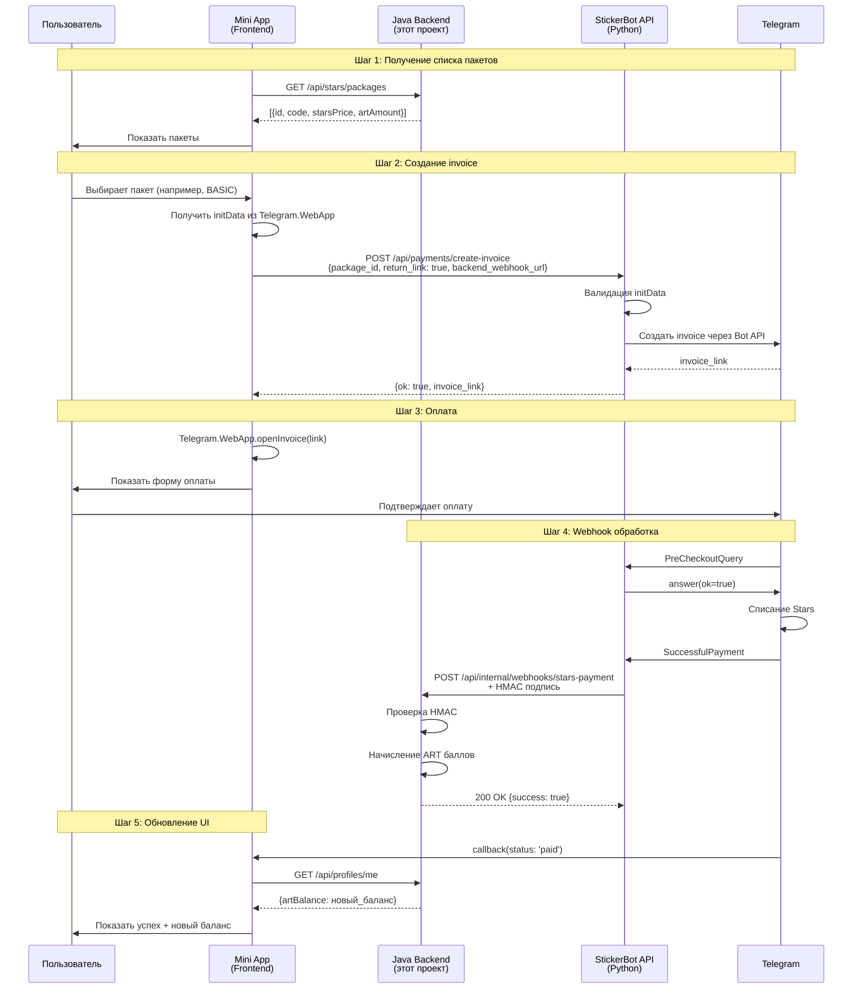

# Telegram Stars Payment Integration - Frontend Guide

## 📋 Оглавление

1. [Обзор](#обзор)
2. [Архитектура](#архитектура)
3. [Настройка](#настройка)
4. [API Endpoints](#api-endpoints)
5. [Интеграция в Mini App](#интеграция-в-mini-app)
6. [Примеры кода](#примеры-кода)
7. [Обработка ошибок](#обработка-ошибок)
8. [Тестирование](#тестирование)

---

## Обзор

Система оплаты через **Telegram Stars** позволяет пользователям покупать ART-баллы прямо в Mini App. Процесс проходит в три этапа:

1. **Mini App** → получает список пакетов из Java backend
2. **Mini App** → создает invoice через внешний **StickerBot API**
3. **StickerBot API** → уведомляет Java backend о платеже через webhook

### Почему два сервиса?

- **Java Backend** (этот проект) - управляет бизнес-логикой, балансом пользователей, базой данных
- **StickerBot API** (`stixly-e13nst.amvera.io`) - Python-сервис, который взаимодействует с Telegram Bot API для создания invoices

---

## Архитектура



---

## Настройка

### 1. Переменные окружения Backend

Убедитесь что в `.env.app` установлены:

```bash
# URL вашего Java backend
APP_URL=https://your-backend.com

# Секрет для HMAC проверки webhook от StickerBot API
BACKEND_WEBHOOK_SECRET=db5aa85012491cdb6f0d4e8093f53a00deb048bfcb6d89541d5d6a7309aee365
```

### 2. URL внешних сервисов

- **Java Backend**: `https://your-backend.com` (ваш домен)
- **StickerBot API**: `https://stixly-e13nst.amvera.io` (внешний сервис)

---

## API Endpoints

### Java Backend (ваш проект)

#### 1. Получить список пакетов

```http
GET /api/stars/packages
```

**Headers:**
```
X-Telegram-Init-Data: <initData из Telegram.WebApp.initData>
```

**Response:**
```json
[
  {
    "id": 1,
    "code": "STARTER",
    "name": "Starter Pack",
    "description": "100 ART баллов",
    "starsPrice": 50,
    "artAmount": 100,
    "sortOrder": 1,
    "createdAt": "2025-01-15T10:00:00Z"
  },
  {
    "id": 2,
    "code": "BASIC",
    "name": "Basic Pack",
    "description": "250 ART баллов",
    "starsPrice": 100,
    "artAmount": 250,
    "sortOrder": 2,
    "createdAt": "2025-01-15T10:00:00Z"
  }
]
```

#### 2. Получить конфигурацию для оплаты

```http
GET /api/stars/config
```

**Response:**
```json
{
  "botApiUrl": "https://stixly-e13nst.amvera.io",
  "webhookUrl": "https://your-backend.com/api/internal/webhooks/stars-payment"
}
```

#### 3. Получить историю покупок

```http
GET /api/stars/purchases?page=0&size=10
```

**Response:**
```json
{
  "content": [
    {
      "id": 123,
      "packageCode": "BASIC",
      "starsPaid": 100,
      "artCredited": 250,
      "createdAt": "2025-02-06T12:00:00Z"
    }
  ],
  "totalElements": 5,
  "totalPages": 1
}
```

#### 4. Получить последнюю покупку

```http
GET /api/stars/purchases/recent
```

**Response:**
```json
{
  "id": 123,
  "packageCode": "BASIC",
  "starsPaid": 100,
  "artCredited": 250,
  "createdAt": "2025-02-06T12:00:00Z"
}
```

или `404 Not Found` если покупок нет.

---

### StickerBot API (внешний сервис)

#### Создать invoice

```http
POST https://stixly-e13nst.amvera.io/api/payments/create-invoice
```

**Headers:**
```
Content-Type: application/json
X-Telegram-Init-Data: <initData из Telegram.WebApp.initData>
```

**Request Body:**
```json
{
  "user_id": 141614461,
  "title": "Basic Pack",
  "description": "250 ART баллов",
  "amount_stars": 100,
  "payload": "{\"package_id\": 2}",
  "return_link": true,
  "backend_webhook_url": "https://your-backend.com/api/internal/webhooks/stars-payment"
}
```

**Response (успех):**
```json
{
  "ok": true,
  "invoice_sent": false,
  "invoice_link": "https://t.me/$abcdef1234567890ABCDEF..."
}
```

**Response (ошибка):**
```json
{
  "ok": false,
  "error": "Invalid initData"
}
```

---

## Интеграция в Mini App

### Установка Telegram WebApp SDK

Подключите SDK в вашем HTML:

```html
<!DOCTYPE html>
<html>
<head>
    <meta charset="UTF-8">
    <meta name="viewport" content="width=device-width, initial-scale=1.0">
    <title>Sticker Gallery</title>
    <script src="https://telegram.org/js/telegram-web-app.js"></script>
</head>
<body>
    <!-- Ваш контент -->
    <script src="app.js"></script>
</body>
</html>
```

### Инициализация

```javascript
// Инициализация Telegram WebApp
const tg = window.Telegram.WebApp;
tg.ready();
tg.expand();

// Получение initData для авторизации
const initData = tg.initData;
const userId = tg.initDataUnsafe.user?.id;

if (!initData || !userId) {
    tg.showAlert('Ошибка: не удалось получить данные пользователя');
}
```

---

## Примеры кода

### Полный пример класса PaymentService

```javascript
class StarsPaymentService {
    constructor(backendUrl) {
        this.backendUrl = backendUrl;
        this.botApiUrl = null;
        this.webhookUrl = null;
    }
    
    /**
     * Инициализация - получение конфигурации
     */
    async init() {
        try {
            const response = await fetch(`${this.backendUrl}/api/stars/config`, {
                headers: {
                    'X-Telegram-Init-Data': Telegram.WebApp.initData
                }
            });
            
            if (!response.ok) {
                throw new Error('Failed to load config');
            }
            
            const config = await response.json();
            this.botApiUrl = config.botApiUrl;
            this.webhookUrl = config.webhookUrl;
            
            console.log('✅ Payment service initialized', config);
        } catch (error) {
            console.error('❌ Failed to initialize payment service', error);
            throw error;
        }
    }
    
    /**
     * Получить список доступных пакетов
     */
    async getPackages() {
        try {
            const response = await fetch(`${this.backendUrl}/api/stars/packages`, {
                headers: {
                    'X-Telegram-Init-Data': Telegram.WebApp.initData
                }
            });
            
            if (!response.ok) {
                throw new Error('Failed to load packages');
            }
            
            return await response.json();
        } catch (error) {
            console.error('❌ Failed to load packages', error);
            throw error;
        }
    }
    
    /**
     * Создать invoice и открыть форму оплаты
     * @param {Object} package - Пакет для покупки
     * @returns {Promise<string>} - Статус оплаты: 'paid', 'cancelled', 'failed', 'pending'
     */
    async purchasePackage(package) {
        const userId = Telegram.WebApp.initDataUnsafe.user?.id;
        
        if (!userId) {
            throw new Error('User ID not available');
        }
        
        if (!this.botApiUrl || !this.webhookUrl) {
            await this.init();
        }
        
        try {
            // Шаг 1: Создать invoice через StickerBot API
            console.log('📝 Creating invoice...', {
                packageId: package.id,
                starsPrice: package.starsPrice
            });
            
            const response = await fetch(`${this.botApiUrl}/api/payments/create-invoice`, {
                method: 'POST',
                headers: {
                    'Content-Type': 'application/json',
                    'X-Telegram-Init-Data': Telegram.WebApp.initData
                },
                body: JSON.stringify({
                    user_id: userId,
                    title: package.name,
                    description: package.description,
                    amount_stars: package.starsPrice,
                    payload: JSON.stringify({ 
                        package_id: package.id,
                        timestamp: Date.now()
                    }),
                    return_link: true,
                    backend_webhook_url: this.webhookUrl
                })
            });
            
            if (!response.ok) {
                const error = await response.json();
                throw new Error(error.error || 'Failed to create invoice');
            }
            
            const data = await response.json();
            
            if (!data.ok || !data.invoice_link) {
                throw new Error(data.error || 'Invalid invoice response');
            }
            
            console.log('✅ Invoice created successfully');
            
            // Шаг 2: Открыть форму оплаты в Mini App
            return new Promise((resolve) => {
                Telegram.WebApp.openInvoice(data.invoice_link, (status) => {
                    console.log('💳 Payment status:', status);
                    resolve(status);
                });
            });
            
        } catch (error) {
            console.error('❌ Payment error:', error);
            throw error;
        }
    }
    
    /**
     * Получить последнюю покупку пользователя
     */
    async getRecentPurchase() {
        try {
            const response = await fetch(`${this.backendUrl}/api/stars/purchases/recent`, {
                headers: {
                    'X-Telegram-Init-Data': Telegram.WebApp.initData
                }
            });
            
            if (response.status === 404) {
                return null; // Нет покупок
            }
            
            if (!response.ok) {
                throw new Error('Failed to load recent purchase');
            }
            
            return await response.json();
        } catch (error) {
            console.error('❌ Failed to load recent purchase', error);
            return null;
        }
    }
    
    /**
     * Обновить баланс пользователя
     */
    async refreshBalance() {
        try {
            const response = await fetch(`${this.backendUrl}/api/profiles/me`, {
                headers: {
                    'X-Telegram-Init-Data': Telegram.WebApp.initData
                }
            });
            
            if (!response.ok) {
                throw new Error('Failed to load profile');
            }
            
            const profile = await response.json();
            return profile.artBalance;
        } catch (error) {
            console.error('❌ Failed to refresh balance', error);
            return null;
        }
    }
}
```

### Использование в UI

```javascript
// Инициализация
const paymentService = new StarsPaymentService('https://your-backend.com');

// При загрузке страницы
async function loadPackages() {
    try {
        const packages = await paymentService.getPackages();
        
        packages.forEach(pkg => {
            const button = document.createElement('button');
            button.className = 'package-button';
            button.innerHTML = `
                <div class="package-name">${pkg.name}</div>
                <div class="package-price">${pkg.starsPrice} ⭐</div>
                <div class="package-art">+${pkg.artAmount} ART</div>
            `;
            button.onclick = () => handlePurchase(pkg);
            
            document.getElementById('packages-container').appendChild(button);
        });
    } catch (error) {
        Telegram.WebApp.showAlert('Ошибка загрузки пакетов');
    }
}

// Обработка покупки
async function handlePurchase(package) {
    const tg = Telegram.WebApp;
    
    try {
        tg.MainButton.showProgress();
        
        // Создать invoice и открыть форму оплаты
        const status = await paymentService.purchasePackage(package);
        
        tg.MainButton.hideProgress();
        
        switch (status) {
            case 'paid':
                // ✅ Оплата успешна!
                tg.showAlert('Оплата прошла успешно! 🎉', async () => {
                    // Обновить баланс
                    const newBalance = await paymentService.refreshBalance();
                    if (newBalance !== null) {
                        updateBalanceUI(newBalance);
                    }
                });
                
                // Опционально: показать анимацию
                showSuccessAnimation();
                
                // Опционально: вибрация
                tg.HapticFeedback.notificationOccurred('success');
                break;
                
            case 'cancelled':
                // ❌ Пользователь отменил
                tg.showAlert('Оплата отменена');
                tg.HapticFeedback.notificationOccurred('warning');
                break;
                
            case 'failed':
                // ⚠️ Ошибка оплаты
                tg.showAlert('Ошибка оплаты. Попробуйте снова.');
                tg.HapticFeedback.notificationOccurred('error');
                break;
                
            case 'pending':
                // ⏳ В обработке (редко)
                tg.showAlert('Платеж обрабатывается...');
                break;
        }
        
    } catch (error) {
        tg.MainButton.hideProgress();
        tg.showAlert('Ошибка: ' + error.message);
        tg.HapticFeedback.notificationOccurred('error');
    }
}

function updateBalanceUI(balance) {
    document.getElementById('art-balance').textContent = balance;
}

function showSuccessAnimation() {
    // Ваша анимация успеха (например, Lottie)
}

// Инициализация при загрузке
document.addEventListener('DOMContentLoaded', () => {
    Telegram.WebApp.ready();
    loadPackages();
});
```

### React пример

```jsx
import { useState, useEffect } from 'react';

function StarsPayment() {
    const [packages, setPackages] = useState([]);
    const [loading, setLoading] = useState(false);
    const [balance, setBalance] = useState(0);
    const [paymentService] = useState(() => 
        new StarsPaymentService('https://your-backend.com')
    );
    
    useEffect(() => {
        loadPackages();
        loadBalance();
    }, []);
    
    async function loadPackages() {
        try {
            const data = await paymentService.getPackages();
            setPackages(data);
        } catch (error) {
            window.Telegram.WebApp.showAlert('Ошибка загрузки пакетов');
        }
    }
    
    async function loadBalance() {
        const newBalance = await paymentService.refreshBalance();
        if (newBalance !== null) {
            setBalance(newBalance);
        }
    }
    
    async function handlePurchase(pkg) {
        setLoading(true);
        
        try {
            const status = await paymentService.purchasePackage(pkg);
            
            if (status === 'paid') {
                window.Telegram.WebApp.showAlert('Оплата прошла успешно! 🎉');
                await loadBalance(); // Обновить баланс
            } else if (status === 'cancelled') {
                window.Telegram.WebApp.showAlert('Оплата отменена');
            } else {
                window.Telegram.WebApp.showAlert('Ошибка оплаты');
            }
        } catch (error) {
            window.Telegram.WebApp.showAlert('Ошибка: ' + error.message);
        } finally {
            setLoading(false);
        }
    }
    
    return (
        <div className="payment-container">
            <div className="balance">
                <span>Баланс ART:</span>
                <strong>{balance}</strong>
            </div>
            
            <div className="packages-grid">
                {packages.map(pkg => (
                    <div key={pkg.id} className="package-card">
                        <h3>{pkg.name}</h3>
                        <p>{pkg.description}</p>
                        <div className="package-details">
                            <span className="price">{pkg.starsPrice} ⭐</span>
                            <span className="art">+{pkg.artAmount} ART</span>
                        </div>
                        <button 
                            onClick={() => handlePurchase(pkg)}
                            disabled={loading}
                            className="purchase-button"
                        >
                            {loading ? 'Обработка...' : 'Купить'}
                        </button>
                    </div>
                ))}
            </div>
        </div>
    );
}

export default StarsPayment;
```

---

## Обработка ошибок

### Типичные ошибки и решения

#### 1. "Telegram WebApp не инициализирован"

**Причина:** SDK не загружен или Mini App открыт вне Telegram

**Решение:**
```javascript
if (!window.Telegram?.WebApp?.initData) {
    console.error('App must be opened in Telegram');
    document.body.innerHTML = '<h1>Откройте приложение в Telegram</h1>';
    return;
}
```

#### 2. "Invalid initData" от StickerBot API

**Причина:** initData устарел (> 1 часа) или невалиден

**Решение:**
```javascript
try {
    const response = await fetch(url, { /* ... */ });
    if (!response.ok) {
        const error = await response.json();
        if (error.error?.includes('initData')) {
            Telegram.WebApp.showAlert('Сессия устарела. Перезапустите приложение.');
            // Опционально: предложить перезагрузить
            setTimeout(() => window.location.reload(), 2000);
        }
    }
} catch (error) {
    // handle
}
```

#### 3. "Failed to create invoice"

**Причина:** Проблемы с StickerBot API или неверные параметры

**Решение:**
```javascript
try {
    const status = await paymentService.purchasePackage(pkg);
} catch (error) {
    console.error('Payment error:', error);
    
    // Логирование для отладки
    console.log('Debug info:', {
        packageId: pkg.id,
        userId: Telegram.WebApp.initDataUnsafe.user?.id,
        initDataLength: Telegram.WebApp.initData?.length
    });
    
    Telegram.WebApp.showAlert('Ошибка создания платежа. Попробуйте позже.');
}
```

#### 4. Webhook не доставлен (backend не получил уведомление)

**Симптомы:** Статус в Telegram показывает 'paid', но баланс не обновился

**Причина:** 
- Backend недоступен
- HMAC подпись невалидна
- Ошибка в обработке webhook

**Решение:**
```javascript
// Проверить последнюю покупку через некоторое время
async function verifyPayment(expectedPackageId) {
    // Подождать 2 секунды (дать время на webhook)
    await new Promise(resolve => setTimeout(resolve, 2000));
    
    const recentPurchase = await paymentService.getRecentPurchase();
    
    if (recentPurchase && recentPurchase.packageId === expectedPackageId) {
        // Покупка подтверждена
        return true;
    }
    
    // Покупка не найдена - возможно проблема с webhook
    console.warn('Payment verification failed');
    Telegram.WebApp.showAlert(
        'Оплата прошла, но обработка задерживается. ' +
        'Проверьте баланс через несколько минут.'
    );
    return false;
}

// Использование
if (status === 'paid') {
    const verified = await verifyPayment(package.id);
    if (verified) {
        showSuccessAnimation();
    }
}
```

---

## Тестирование

### 1. Тестирование в Telegram Test Environment

Telegram предоставляет тестовую среду для Stars payments:

```javascript
// В dev окружении можно использовать минимальную сумму
const testPackage = {
    id: 999,
    name: 'Test Pack',
    description: 'Тестовый платеж',
    starsPrice: 1, // Минимум 1 Star
    artAmount: 10
};
```

### 2. Mock для локальной разработки

```javascript
class MockPaymentService extends StarsPaymentService {
    async purchasePackage(package) {
        console.log('🧪 Mock payment:', package);
        
        // Имитация задержки
        await new Promise(resolve => setTimeout(resolve, 2000));
        
        // Всегда успешно в dev режиме
        return 'paid';
    }
}

// Использование
const isDev = window.location.hostname === 'localhost';
const paymentService = isDev 
    ? new MockPaymentService('http://localhost:8080')
    : new StarsPaymentService('https://your-backend.com');
```

### 3. Проверка CORS

Убедитесь что backend разрешает CORS для вашего домена:

```bash
# Проверка через curl
curl -H "Origin: https://your-frontend.com" \
     -H "Access-Control-Request-Method: POST" \
     -H "Access-Control-Request-Headers: X-Telegram-Init-Data" \
     -X OPTIONS \
     https://your-backend.com/api/stars/packages
```

### 4. Логирование

Включите подробное логирование для отладки:

```javascript
class StarsPaymentService {
    constructor(backendUrl, debug = false) {
        this.backendUrl = backendUrl;
        this.debug = debug;
    }
    
    log(...args) {
        if (this.debug) {
            console.log('[StarsPayment]', ...args);
        }
    }
    
    async purchasePackage(package) {
        this.log('Starting purchase', package);
        
        // ... rest of the code with this.log() calls
    }
}

// Использование
const paymentService = new StarsPaymentService(
    'https://your-backend.com',
    true // включить debug логи
);
```

---

## Безопасность

### 1. Никогда не храните секреты в frontend

❌ **Неправильно:**
```javascript
const BACKEND_WEBHOOK_SECRET = 'db5aa85012...'; // НЕТ!
```

✅ **Правильно:**
```javascript
// Секреты хранятся только на backend
// Frontend использует только initData для авторизации
```

### 2. Всегда проверяйте initData

```javascript
function validateInitData() {
    const initData = Telegram.WebApp.initData;
    
    if (!initData || initData.length < 10) {
        throw new Error('Invalid initData');
    }
    
    // initData содержит подпись от Telegram - backend проверит её
    return initData;
}
```

### 3. Не доверяйте client-side данным

```javascript
// ❌ НЕ делайте так:
const balance = localStorageGet('artBalance');

// ✅ Всегда получайте данные с backend:
const balance = await paymentService.refreshBalance();
```

---

## Поддержка

### Логи для отладки

При проблемах проверьте логи:

**Frontend (Browser Console):**
```javascript
console.log('Telegram WebApp version:', Telegram.WebApp.version);
console.log('User ID:', Telegram.WebApp.initDataUnsafe.user?.id);
console.log('initData length:', Telegram.WebApp.initData?.length);
```

**Backend (Java logs):**
```bash
# Поиск логов по платежам
grep -i "payment\|webhook\|stars" logs/app.log

# Последние 50 строк с платежами
tail -50 logs/app.log | grep -i payment
```

### Чеклист проблем

- [ ] Telegram WebApp SDK загружен?
- [ ] initData доступен и не пустой?
- [ ] Backend доступен по HTTPS?
- [ ] CORS настроен правильно?
- [ ] BACKEND_WEBHOOK_SECRET установлен в .env.app?
- [ ] StickerBot API доступен?
- [ ] Пакеты существуют в БД (проверить через /api/stars/packages)?

---

**Версия документа:** 1.0  
**Дата:** 2026-02-06  
**Автор:** Backend Team

Для вопросов и предложений создавайте issue в репозитории проекта.
