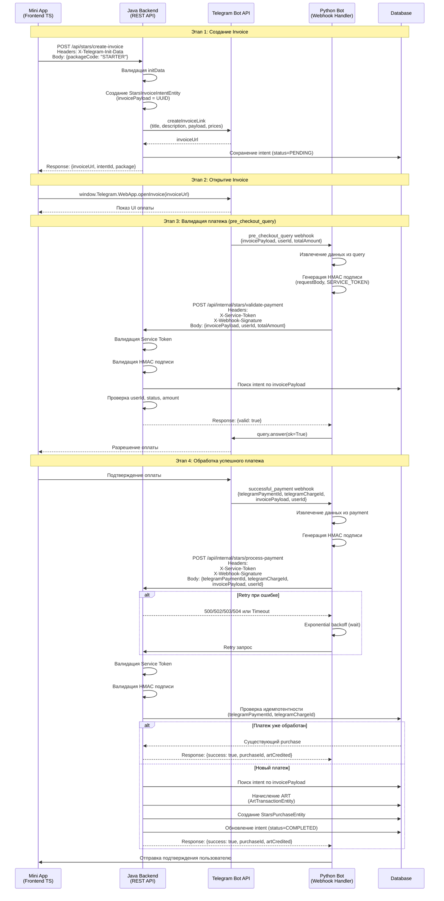

# Схема взаимодействия Telegram Stars: Python-бот ↔ Java Backend

## Полный Flow оплаты



## Архитектура компонентов

```
┌─────────────────────────────────────────────────────────────────┐
│                         Telegram Mini App                        │
│                         (TypeScript Frontend)                    │
│                                                                   │
│  - WebApp SDK: window.Telegram.WebApp                            │
│  - Инициирует оплату через Java API                              │
│  - Открывает invoice через openInvoice()                         │
└───────────────────────┬─────────────────────────────────────────┘
                        │
                        │ HTTPS + X-Telegram-Init-Data
                        │
                        ▼
┌─────────────────────────────────────────────────────────────────┐
│                        Java Backend                              │
│                    (Spring Boot REST API)                        │
│                                                                   │
│  ┌───────────────────────────────────────────────────────────┐  │
│  │ StarsController                                            │  │
│  │  - POST /api/stars/create-invoice                          │  │
│  │  - GET /api/stars/packages                                 │  │
│  │  - GET /api/stars/purchases                                │  │
│  └───────────────────────────────────────────────────────────┘  │
│                                                                   │
│  ┌───────────────────────────────────────────────────────────┐  │
│  │ StarsInternalController                                    │  │
│  │  - POST /api/internal/stars/validate-payment              │  │
│  │  - POST /api/internal/stars/process-payment                │  │
│  │  Security: ServiceTokenAuthenticationFilter                │  │
│  │  Security: WebhookSignatureFilter (NEW)                    │  │
│  └───────────────────────────────────────────────────────────┘  │
│                                                                   │
│  ┌───────────────────────────────────────────────────────────┐  │
│  │ StarsPaymentService                                         │  │
│  │  - createInvoice()                                         │  │
│  │  - validatePreCheckout()                                   │  │
│  │  - processSuccessfulPayment()                              │  │
│  │  - Идемпотентность через telegramPaymentId                 │  │
│  └───────────────────────────────────────────────────────────┘  │
│                                                                   │
│  ┌───────────────────────────────────────────────────────────┐  │
│  │ TelegramBotApiService                                       │  │
│  │  - createInvoiceLink() → Telegram Bot API                  │  │
│  └───────────────────────────────────────────────────────────┘  │
│                                                                   │
│  ┌───────────────────────────────────────────────────────────┐  │
│  │ ArtRewardService                                            │  │
│  │  - award() → Начисление ART                                 │  │
│  └───────────────────────────────────────────────────────────┘  │
└───────────────────────┬─────────────────────────────────────────┘
                        │
                        │ HTTPS + X-Service-Token + X-Webhook-Signature
                        │
                        ▼
┌─────────────────────────────────────────────────────────────────┐
│                        Python Bot                                │
│                    (python-telegram-bot)                        │
│                                                                   │
│  ┌───────────────────────────────────────────────────────────┐  │
│  │ pre_checkout_query_handler                                 │  │
│  │  - Получает pre_checkout_query от Telegram                 │  │
│  │  - Генерирует HMAC подпись (NEW)                           │  │
│  │  - Вызывает Java API /validate-payment                     │  │
│  │  - Retry с exponential backoff (NEW)                        │  │
│  │  - Отвечает query.answer()                                 │  │
│  └───────────────────────────────────────────────────────────┘  │
│                                                                   │
│  ┌───────────────────────────────────────────────────────────┐  │
│  │ successful_payment_handler                                   │  │
│  │  - Получает successful_payment от Telegram                 │  │
│  │  - Генерирует HMAC подпись (NEW)                            │  │
│  │  - Вызывает Java API /process-payment                       │  │
│  │  - Retry с exponential backoff (NEW)                         │  │
│  │  - Уведомляет пользователя                                  │  │
│  └───────────────────────────────────────────────────────────┘  │
└───────────────────────┬─────────────────────────────────────────┘
                        │
                        │ Webhook
                        │
                        ▼
┌─────────────────────────────────────────────────────────────────┐
│                      Telegram Bot API                             │
│                                                                   │
│  - Отправляет pre_checkout_query                                 │
│  - Отправляет successful_payment                                 │
│  - Обрабатывает createInvoiceLink                                │
└─────────────────────────────────────────────────────────────────┘
```

## Структура данных

### Request: Validate Payment
```json
POST /api/internal/stars/validate-payment
Headers:
  X-Service-Token: <token>
  X-Webhook-Signature: <hmac_hex>
  Content-Type: application/json

Body:
{
  "invoicePayload": "550e8400-e29b-41d4-a716-446655440000",
  "userId": 123456789,
  "totalAmount": 50
}
```

### Response: Validate Payment
```json
HTTP 200 OK
{
  "valid": true,
  "errorMessage": null
}
```

### Request: Process Payment
```json
POST /api/internal/stars/process-payment
Headers:
  X-Service-Token: <token>
  X-Webhook-Signature: <hmac_hex>
  Content-Type: application/json

Body:
{
  "telegramPaymentId": "payment_1234567890",
  "telegramChargeId": "charge_1234567890",
  "invoicePayload": "550e8400-e29b-41d4-a716-446655440000",
  "userId": 123456789
}
```

### Response: Process Payment
```json
HTTP 200 OK
{
  "success": true,
  "purchaseId": 123,
  "artCredited": 100,
  "errorMessage": null
}
```

## Алгоритм HMAC подписи

```
1. Python Bot:
   requestBody = json.dumps(payload, separators=(',', ':'))
   signature = HMAC-SHA256(requestBody, SERVICE_TOKEN).hexdigest()
   Headers['X-Webhook-Signature'] = signature

2. Java Backend:
   receivedSignature = request.getHeader("X-Webhook-Signature")
   requestBody = getRequestBody(request)
   expectedSignature = HMAC-SHA256(requestBody, SERVICE_TOKEN).hexdigest()
   
   if (constantTimeEquals(receivedSignature, expectedSignature)):
       // Продолжить обработку
   else:
       // Вернуть 401 Unauthorized
```

## Retry Strategy

```
Attempt 1: Immediate
Attempt 2: Wait 1-2 seconds (exponential backoff)
Attempt 3: Wait 2-4 seconds
Attempt 4: Wait 4-8 seconds (если MAX_RETRIES=4)

Retry на:
- 429 Too Many Requests
- 500 Internal Server Error
- 502 Bad Gateway
- 503 Service Unavailable
- 504 Gateway Timeout
- TimeoutException
- Network errors

Не retry на:
- 400 Bad Request
- 401 Unauthorized
- 404 Not Found
- 409 Conflict
```

## Идемпотентность

```
Java Backend проверяет:
1. stars_purchases.telegram_payment_id = ?
2. stars_purchases.telegram_charge_id = ?

Если найден существующий purchase:
  → Возвращает существующий результат
  → Не создает дубликат
  → Не начисляет ART повторно

Если не найден:
  → Создает новый purchase
  → Начисляет ART
  → Сохраняет в БД
```
